# 🍪 Cookie Extraction for Semi-Automated Web Scraping

## Overview

This document explains how `extract_cookies.py` works in a semi-automated web scraping workflow.

---

## 1. Overall Workflow


---

## 2. Two Connection Modes

### Mode 1: Connect to Existing Browser


### Mode 2: Launch New Browser


---

## 3. Complete Data Flow


---

## 4. Cookie Structure

```json
[
  {
    "name": "sessionid",
    "value": "abc123xyz789...",
    "domain": ".quotes.toscrape.com",
    "path": "/",
    "expires": 1739999999,
    "httpOnly": true,
    "secure": false,
    "sameSite": "Lax"
  },
  {
    "name": "csrftoken",
    "value": "def456abc789...",
    "domain": ".quotes.toscrape.com",
    "path": "/",
    "expires": 1739999999,
    "httpOnly": false,
    "secure": false,
    "sameSite": "Lax"
  }
]
```

---

## 5. Code Flow Diagram


---

## 6. How Scrapy Uses the Cookies


---

## 7. Key Functions Explained

| Function | Purpose | Returns |
|----------|---------|---------|
| `sync_playwright()` | Creates Playwright context manager | Playwright instance |
| `connect_over_cdp()` | Connects to running Chrome | Browser instance |
| `launch_persistent_context()` | Launches new Chrome | Context instance |
| `context.cookies()` | Gets all browser cookies | List of cookies |
| `context.close()` | Cleanly closes browser | - |

---

## 8. Pros and Cons

```mermaid
flowchart LR
    subgraph PROS["✅ Advantages"]
        P1[Human handles login/captcha]
        P2[Works with any auth flow]
        P3[Simple to understand]
        P4[No reverse engineering]
    end
    
    subgraph CONS["⚠️ Limitations"]
        C1[Manual step required]
        C2[Cookie expiration]
        C3[Session timeout]
    end
    
    PROS --> Better
    CONS --> Consideration
```



---

## 9. Step-by-Step Usage


---

## 10. File Structure

```
python-scrape/
├── extract_cookies.py      # Cookie extraction script
├── quotes_spider.py        # Scrapy spider
├── quotes/
│   └── settings.py         # Scrapy configuration
├── cookies.json            # Generated cookies (output)
├── quotes.json             # Scraped data (output)
├── README.md               # This documentation
└── requirements.txt        # Python dependencies
```

---

## 11. Error Handling Flow


---

## 12. Security Considerations

```mermaid
flowchart TD
    subgraph Security["Cookie Security"]
        A[✓ httpOnly flag] --> B[Prevents XSS theft]
        C[✓ Secure flag] --> D[HTTPS only transfer]
        E[✓ SameSite] --> F[CSRF protection]
    end
    
    subgraph Best_Practices["Best Practices"]
        G[Store outside git]
        H[Set short expiration]
        I[Use dedicated test accounts]
    end
```



---

## 13. Troubleshooting

| Issue | Solution |
|-------|----------|
| Connection refused :9222 | Install Chrome/Chromium |
| No cookies found | Login first in browser |
| Session expired | Re-login and re-extract |
| Wrong domain cookies | Navigate to correct site first |

---

## 14. Next Steps

1. ✅ Understand the workflow
2. 📋 Try the extraction script
3. 🔧 Customize for your target site
4. 🚀 Scale to production scraping

---

*Generated for Web Scraping Learning*  
*Location: /home/richard/shared/jianglei/openclaw/python-scrape/*
