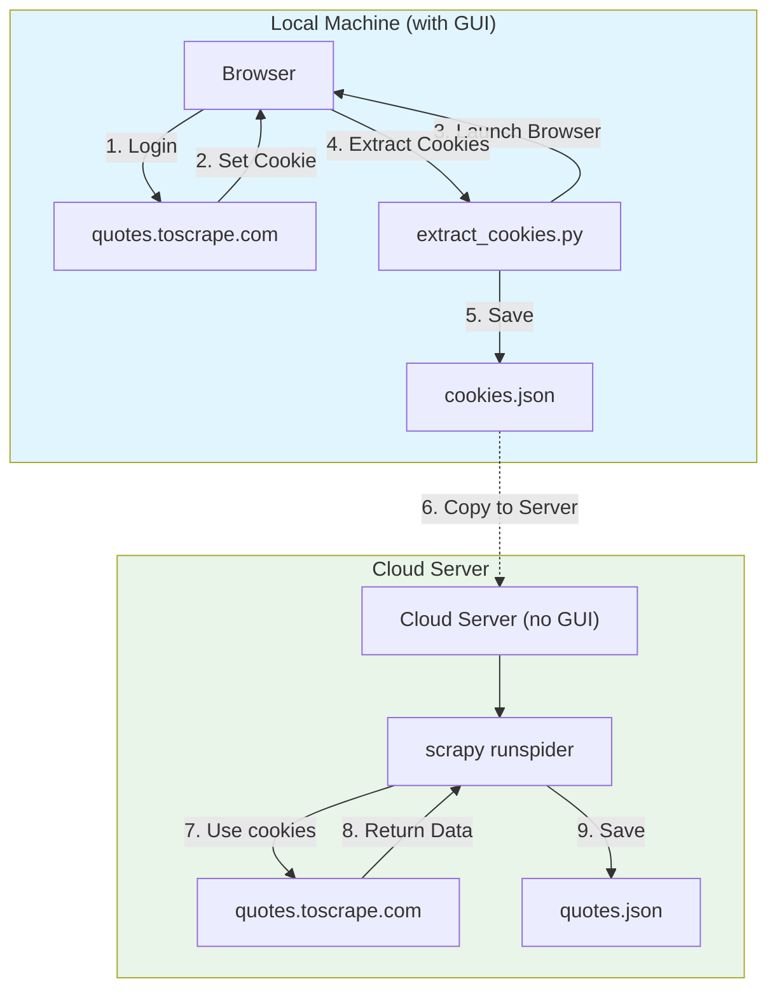

# 🍀 Semi-Automated Web Scraping Project

This project supports two workflows:
1. **Local**: Run everything on your machine
2. **Local + Cloud Server**: Extract cookies locally, scrape on server

This guide explains the recommended **Local + Cloud Server** workflow for 24/7 scraping.

## 📁 Project Structure

```
python-scrape/
├── extract_cookies.py      # Extract cookies from logged-in browser
├── quotes_spider.py        # Scrapy spider for quotes.toscrape.com
├── quotes/
│   └── settings.py         # Scrapy settings
├── scrapy.cfg             # Scrapy configuration
├── cookies.json           # Extracted cookies (generated)
├── quotes.json            # Scraped data (generated)
├── scrapy.log             # Scrapy log file (generated)
└── requirements.txt       # Python dependencies
```

## 🚀 Quick Start

### Step 1: Extract Cookies

```bash
cd /home/richard/shared/jianglei/openclaw/python-scrape
python3 extract_cookies.py http://quotes.toscrape.com/login
```

This will:
- Launch Chrome browser and open the login page
- Wait for you to enter username and password
- After login, press Enter to extract cookies
- Save cookies to `cookies.json`

### Step 3: Run the Spider

```bash
cd /home/richard/shared/jianglei/openclaw/python-scrape
scrapy runspider quotes_spider.py -o quotes.json
```

---

## ☁️ Local + Cloud Server Workflow (Recommended)

This workflow is ideal when you want to scrape on a cloud server without GUI.

### Architecture



### Step-by-Step Guide

#### Step 1: On Local Machine (with GUI)

```bash
# Extract cookies
python3 extract_cookies.py http://quotes.toscrape.com/login
```

After login, the cookies will be saved to `cookies.json`.

#### Step 2: Copy to Cloud Server

```bash
# Using scp (Secure Copy)
scp cookies.json user@your-server:/path/to/project/

# Or using rsync
rsync -avz cookies.json user@your-server:/path/to/project/
```

#### Step 3: On Cloud Server

```bash
# Run the spider (headless, no GUI needed)
scrapy runspider quotes_spider.py -o quotes.json
```

### Why This Works

| Component | Local Machine | Cloud Server |
|-----------|-------------|-------------|
| GUI Required | ✅ Yes | ❌ No |
| Browser | Chrome (manual) | Playwright (headless) |
| Login | Manual | Automatic (cookies) |
| Runs 24/7 | ❌ No | ✅ Yes |

---

## 📝 Workflow (Single Machine)

### Phase 1: Login & Cookie Extraction
```
User → Opens Chrome → Goes to quotes.toscrape.com/login → Logs in
Agent → Runs extract_cookies.py → Gets cookies → Saves to cookies.json
```

### Phase 2: Page Structure Investigation
```
Agent → Uses Playwright to inspect page
     → Identifies CSS selectors for quotes
     → Works with user to refine selectors
     → Updates quotes_spider.py with correct selectors
```

### Phase 3: Scraping
```
Spider → Loads cookies.json
      → Starts from logged-in URL
      → Scrapes all pages
      → Exports to quotes.json
```

## 🔧 Configuration

### Changing the Target Website

Edit `quotes_spider.py`:

```python
class QuotesSpider(scrapy.Spider):
    name = "quotes"
    allowed_domains = ["your-target-domain.com"]
    start_urls = ["http://your-target-domain.com/protected-page"]
```

### Adding More Data Fields

Edit the `parse` method in `quotes_spider.py`:

```python
for quote in quotes:
    item = {
        'text': quote.css('span.text::text').get(),
        'author': quote.css('span small::text').get(),
        'tags': quote.css('div.tags a.tag::text').getall(),
        # Add more fields here
        'date_added': quote.css('::attr(data-date)').get(),
    }
    yield item
```

## 🛡️ Anti-Detection Features

This project includes multiple anti-detection features to avoid being blocked:

| Feature | Description |
|---------|-------------|
| **User-Agent Rotation** | 8 different browser User-Agents rotate per request |
| **Playwright Stealth** | Uses playwright-stealth to hide automation flags |
| **Real Browser Rendering** | Uses headless Chrome (not raw HTTP) |
| **Request Delays** | 2 second delay between requests (randomized) |
| **AutoThrottle** | Automatically adjusts speed based on server response |
| **Proper Headers** | Mimics real browser headers (Accept, Sec-Fetch-*, etc.) |

### Log Levels

```bash
# Standard output (INFO level - shows progress)
scrapy runspider quotes_spider.py -o quotes.json

# Debug output (DEBUG level - shows all details including rotated User-Agents)
scrapy runspider quotes_spider.py -o quotes.json --loglevel=DEBUG

# View log file
cat scrapy.log
```

## 💾 Checkpoint / Resume (断点续传)

The spider automatically saves its progress and can resume from where it left off if interrupted.

### How It Works

| Step | Action |
|------|--------|
| **Load** | On startup, loads previously scraped pages from checkpoint file |
| **Skip** | Skips pages that are already in checkpoint |
| **Save** | After each page is processed, saves URL to checkpoint |
| **Resume** | If interrupted, just run again - it resumes automatically |

### Checkpoint File

- Location: `.scrapy/scraped_pages.json`
- Stores list of already scraped page URLs

### Usage

```bash
# Run the spider (creates checkpoint automatically)
scrapy runspider quotes_spider.py -o quotes.json

# If interrupted, just run again - it will resume from where it left off
scrapy runspider quotes_spider.py -o quotes.json

# View checkpoint status
cat .scrapy/scraped_pages.json

# To start fresh (delete checkpoint)
rm -rf .scrapy/
```

### Example

```
# First run - scrapes all pages
📂 Loaded checkpoint: 0 pages already scraped
✅ Page saved to checkpoint: http://quotes.toscrape.com/
...
Final stats - Requests: 10, Quotes: 100

# Second run - resumes from checkpoint
📂 Loaded checkpoint: 10 pages already scraped
⏭️ Skipping already scraped page: http://quotes.toscrape.com/
⏭️ Next page also already scraped: http://quotes.toscrape.com/page/2/
```

## 🚀 Future Improvements & Production Recommendations

The current solution works well for learning and testing. For production scraping, consider these enhancements:

### Current Solution Assessment

| Feature | Status |
|---------|--------|
| Cookie extraction | ✅ Working |
| Playwright browser | ✅ Working |
| Anti-detection (User-Agent, headers, stealth) | ✅ Working |
| Checkpoint/Resume | ✅ Working |
| Logging | ✅ Working |
| Pagination | ✅ Working |

---

### ⚠️ Potential Improvements

#### 1. **IP Rotation** (High Priority for Production)
- **Current**: Single IP address
- **Risk**: Gets blocked if too many requests
- **Solution**: Use residential proxies (Bright Data, Oxylabs, SmartProxy)

#### 2. **TLS Fingerprinting** (Medium Priority)
- **Current**: Uses real browser TLS (good)
- **Risk**: Sophisticated anti-bot services can detect Python's TLS stack
- **Solution**: Use `curl-cffi` or `undetected-chromedriver`

#### 3. **Cookie Auto-Refresh** (Nice to Have)
- **Current**: Manual re-extraction required
- **Enhancement**: Automatically refresh when session expires

#### 4. **Enhanced Error Handling** (Nice to Have)
- Add retry logic for failed pages
- Save partial results immediately

---

### 🎯 Recommendation

| Use Case | Solution |
|----------|----------|
| **quotes.toscrape.com** (test site) | Current solution is sufficient |
| **Real production sites** | Add IP rotation + TLS fingerprinting + error handling |

---

### 📦 Additional Dependencies (Optional)

```bash
# IP Rotation (proxy integration)
pip3 install scrapy-proxy-pool

# Better TLS mimicry
pip3 install curl-cffi

# Hardened Chrome (undetectable)
pip3 install undetected-chromedriver
```

---

## 🛠️ Installation

Install dependencies:
```bash
pip3 install playwright scrapy scrapy-playwright playwright-stealth
```

Using system Chrome (already installed):
```bash
# No need to download Chromium - using system Google Chrome
```

Verify installation:
```bash
python3 test_install.py
```

## ⚠️ Important Notes

1. **Respect robots.txt** - Always check if scraping is allowed
2. **Rate limiting** - The spider has delays to avoid overloading servers
3. **Legal considerations** - Only scrape sites you have permission to access
4. **Session expiry** - Cookies may expire; re-run extract_cookies.py if needed
5. **Anti-detection** - This project uses stealth techniques; use responsibly

## 📚 Resources

- [Scrapy Documentation](https://docs.scrapy.org/)
- [Playwright Python](https://playwright.dev/python/)
- [CSS Selectors](https://www.w3schools.com/cssref/css_selectors.asp)
